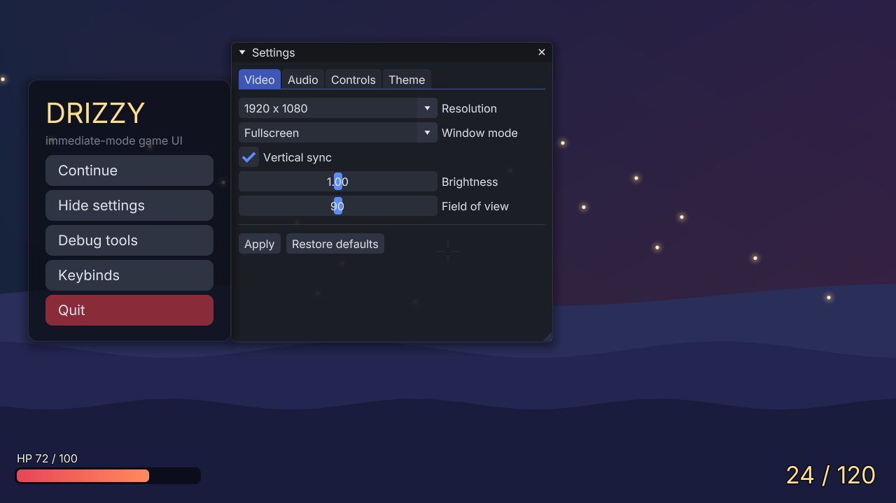
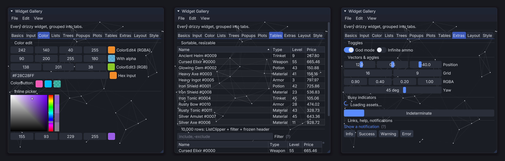
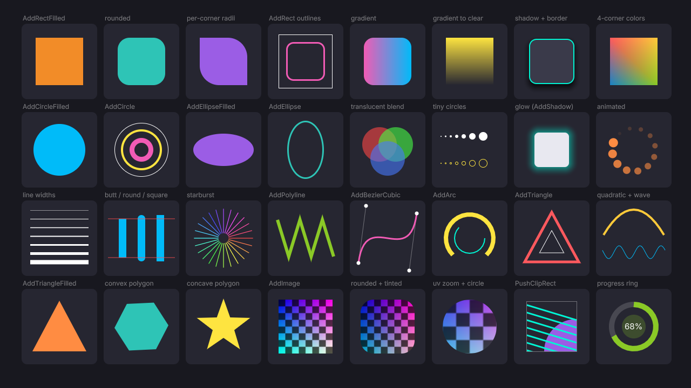
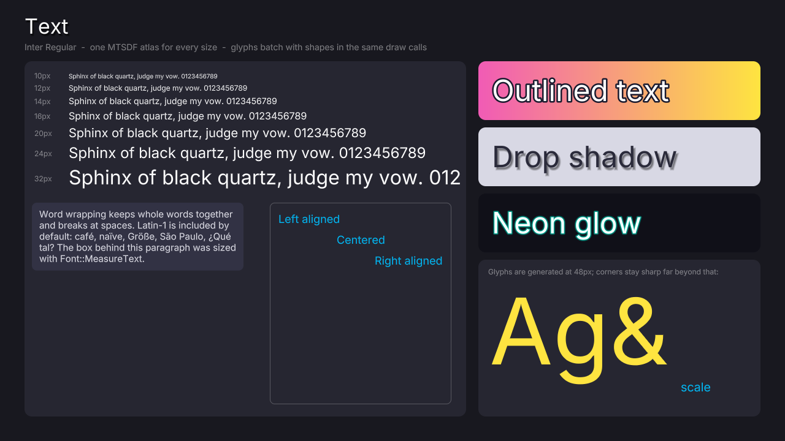
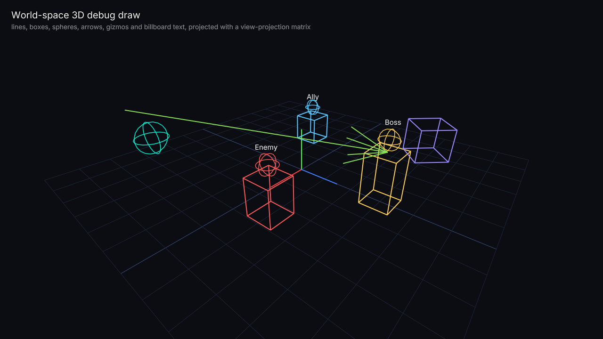
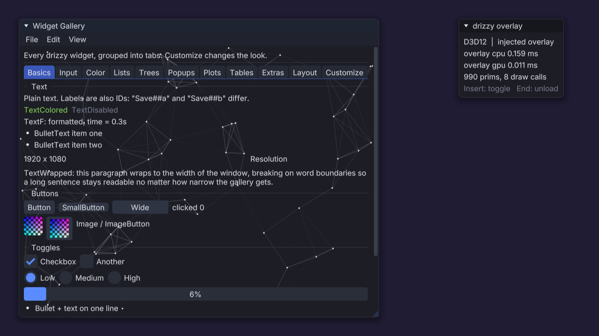

# drizzy_renderer

**A performance-first 2D renderer and immediate-mode UI for Direct3D 11 and 12, built to run as an in-game overlay.**

drizzy draws mod menus, debug tools and HUDs from inside a game's own frame. Its main use is a DLL injected into your
own game that hooks `IDXGISwapChain::Present` and draws a UI over the frame, using nothing but the game's swap chain.
One build covers D3D11 and D3D12 games, including Unity and Unreal titles. It works just as well in any standalone app
that already has a device and a swap chain.



## Why drizzy

- **Made for overlays.** Give it the game's swap chain and it finds the device, draws over the back buffer, and saves
  and restores the device context's state around its own drawing. On D3D12 it keeps its own command list, allocators
  and fence, so it never touches the game's command recording. The library installs no hooks and never calls
  windowing APIs; your loader stays in charge of that.
- **Close to free.** A closed menu costs nothing: no swap chain queries, no state save, no GPU work. A full mod menu
  costs about **0.02 ms of CPU and 0.02 ms of GPU** at 1080p, in 1 to 5 draw calls.
- **Faster than Dear ImGui.** In a head-to-head benchmark run during development, drizzy used less CPU time on every
  workload (**up to 6 times less**), sent less data to the GPU (**up to 9 times less**), and took equal or less GPU
  time. [See the numbers.](#performance)
- **Sharp text at any size.** Fonts become a multi-channel signed distance field atlas, so one atlas serves every size,
  and outlines, drop shadows and glow cost no extra geometry.
- **A complete, familiar UI.** If you have used Dear ImGui, you already know the API: windows, menus, tables, color
  pickers, text input, plots, popups, themes and more.
- **Survives what games do.** Resizes, fullscreen switches, device loss, new devices, and HDR back buffers (sRGB, scRGB
  and HDR10, detected automatically) are all handled.
- **Nothing extra to ship.** Static libraries with stb_truetype and msdfgen compiled in, and shaders compiled at build
  time and embedded. No runtime shader compiler and no extra DLLs.
- **Measures itself.** `LastFrameStats()` reports the overlay's own CPU and GPU time, prim count and draw calls, so you
  can show its cost inside the menu.

## What it draws

**Widgets.** Every widget is in the sample's widget gallery: color editing and pickers, sortable and resizable tables
(with a 10,000-row list that lays out only the visible rows), toggles, vector sliders, spinners and notifications.



**Shapes and text.** Rounded rects with per-corner radii, gradients, shadows and glow, circles, arcs, polylines, Bézier
curves, filled polygons, images and clipping, all anti-aliased in the pixel shader. Text stays sharp from 10 px up to
display sizes and takes outlines, shadows, glow, word wrap and alignment.

<p>
  
  
</p>

**World-space 3D debug drawing.** Pass a view-projection matrix from the game and draw boxes, spheres, arrows, lines and
billboarded labels at world positions. Lines are clipped at the near plane, so geometry behind the camera never streaks
across the screen.



## Performance

Measured in Release on an RTX 4070 Ti SUPER at 1920x1080, D3D11 (D3D12 is within a few percent). You can reproduce
drizzy's own numbers with `drizzy_sandbox --bench`.

| | 1920x1080 | 3840x2160 |
|---|---|---|
| Mod menu (one screen-filling window of widget rows): CPU to build / submit | 0.02 / 0.001 ms | 0.03 / 0.001 ms* |
| The same menu: GPU | 0.019 ms | 0.05 ms |
| 100,000 shapes or 165,000 glyphs: CPU to build | 0.8 ms | 0.8 ms |
| A closed menu | nothing | nothing |

\* The 4K window is twice as tall, so twice as many rows are drawn.

**Against Dear ImGui 1.92.9b.** These numbers are historical: they come from a head-to-head benchmark used during
development, which is not part of this repository, so the table can't be regenerated from it. Both libraries drew the
same workloads on one D3D11 device, with the same font at the same glyph size, the same style metrics, the same curve
segment counts, and both saving and restoring device state as an overlay must. ImGui used its own best settings. CPU
time is build plus submit.

| Workload | CPU ms (drizzy / ImGui) | GPU ms | KB sent per frame | Draw calls |
|---|---|---|---|---|
| Mod menu: 100 rows of text, button, checkbox, slider | 0.020 / 0.044 | 0.017 / 0.022 | 15 / 141 | 2 / 2 |
| 8 plots of 1000 points | 0.038 / 0.223 | 0.036 / 0.047 | 250 / 728 | 2 / 2 |
| 1000 polylines + 1000 curves, 1.5 px | 0.18 / 0.64 | 0.072 / 0.243 | 1439 / 5481 | 1 / 3 |
| The same at 1 px (ImGui's texture-line fast path) | 0.18 / 0.41 | 0.071 / 0.112 | 1439 / 2465 | 1 / 2 |
| 10,000 triangles + 1000 16-gons | 0.13 / 0.42 | 0.056 / 0.124 | 1031 / 2477 | 1 / 2 |
| 300 collapsed tree nodes | 0.017 / 0.028 | 0.014 / 0.014 | 8 / 31 | 2 / 2 |
| 300 buttons with clipped labels | 0.072 / 0.123 | 0.025 / 0.035 | 75 / 460 | 2 / 2 |
| 10,000 text labels | 0.77 / 1.25 | 0.34 / 0.65 | 4855 / 13959 | 1 / 10 |
| 4 near-full-screen windows | 0.003 / 0.008 | 0.041 / 0.042 | 4 / 22 | 8 / 8 |

The one place drizzy loses is software rendering (WARP), where a distance-field glyph costs more per pixel than a
bitmap glyph and text draws about 20% slower.

### How it gets there

Every shape and glyph becomes one 32-byte record (a few, such as gradients or outlined text, take a second). The vertex
shader expands each record into a quad, and the pixel shader computes coverage analytically, so rounded corners,
borders, gradients and anti-aliasing cost no extra geometry. Polylines and polygons are built on the GPU from linked
records, with the miters computed in the vertex shader. Labels that overflow a widget are trimmed glyph by glyph on the
CPU, so they need no extra clip rect or draw call. The UI writes its records straight into mapped GPU memory as it
builds them, so there is nothing left to copy at render time.

## Getting started

### Requirements

- Windows 10 or 11, x64
- Visual Studio 2026 with the **Desktop development with C++** workload. It includes CMake 3.21+ and the Windows SDK,
  whose `fxc` and `dxc` compile the shaders at build time.
- A GPU with Direct3D 11 support; the D3D12 backend needs shader model 6.0.
- Optional: the Windows **Graphics Tools** feature, for the D3D debug layers that Debug builds turn on.

### Build

Get the source with git:

```
git clone https://github.com/CantReverse/DrizzyDrake-Rendering-Libary.git
cd DrizzyDrake-Rendering-Libary
```

Without git, use **Code > Download ZIP** on the GitHub page and extract it. Then, from the repository root:

```
cmake --preset vs2026
cmake --build --preset release
```

Use `--preset debug` for a Debug build. Everything lands in `build/Release` (or `build/Debug`). You can also open
`build/drizzy_renderer.slnx` in Visual Studio, or open the folder in VS Code with the CMake Tools extension and pick the
`vs2026` preset.

| Target | What it is |
|---|---|
| `drizzy_core` | Shapes, text, UI and 3D debug drawing. No OS or graphics API code. |
| `drizzy_d3d11`, `drizzy_d3d12` | The Direct3D backends and the swap-chain overlay bridges. |
| `drizzy_sandbox` | Standalone test app: every scene, screenshots and the benchmark, on either API. |
| `drizzy_overlay_dll` | A ready-to-inject overlay DLL that draws the widget gallery. |
| `drizzy_overlay_dll_test` | A stand-in "game" that loads the DLL, so the whole hook path runs without a real game. |

### Build options

| Option | Default | Effect |
|---|---|---|
| `DRIZZY_BUILD_D3D11` / `DRIZZY_BUILD_D3D12` | ON | Build each backend. |
| `DRIZZY_BUILD_SAMPLES` | ON when top level | Build the sandbox, the overlay DLL and its test host. |
| `DRIZZY_EMBED_DEFAULT_FONT` | ON | Embed Inter Regular for `FontAtlas::AddFontDefault()`. |
| `DRIZZY_ENABLE_LTO` | ON | Link-time code generation in optimized builds. A DLL linking the libraries links with `/LTCG`. |
| `DRIZZY_ENABLE_AVX2` | OFF | `/arch:AVX2`. Only enable it if every player's CPU has AVX2 (2013 or newer). |

### Run the samples

```
build/Release/drizzy_sandbox.exe [--api d3d11|d3d12]
build/Release/drizzy_sandbox.exe --scene gallery --screenshot out.png
build/Release/drizzy_sandbox.exe --bench [--size 3840x2160]
build/Release/drizzy_overlay_dll_test.exe [--api d3d11|d3d12] [--screenshot out.png]
```

In the sandbox window, keys `1` to `7` switch scenes (shapes, text, two stress tests, game UI, widget gallery, 3D debug
drawing), and `F1` opens the keybinds window, where every shortcut can be rebound. Run `drizzy_sandbox --help` for every
option.

## Using drizzy in your project

Add the repository as a subdirectory and link the backend you need. The samples are skipped automatically when drizzy is
not the top-level project.

```cmake
add_subdirectory(external/drizzy_renderer)
target_link_libraries(my_mod PRIVATE drizzy::d3d11 drizzy::d3d12)
```

### As an injected overlay

Inside your `IDXGISwapChain::Present` hook (D3D11 shown):

```cpp
drizzy::overlay::D3D11Overlay overlay;   // lives across frames
drizzy::Win32Input input;

// first call: set up from the swap chain, then upload the font atlas
overlay.Initialize(swapChain);
atlas.SetTexture(overlay.Renderer().CreateTexture(atlas.Width(), atlas.Height(), atlas.Pixels()));
atlas.ReleasePixels();
ui.SetPrimAllocator(&overlay.Renderer());  // the UI records straight into GPU memory

// every Present:
input.NewFrame(ui, hwnd);
ui.NewFrame();
if (menuOpen) BuildModMenu(ui);
overlay.Render(swapChain, ui.Render());   // draws over the game's frame and restores its state

// in your ResizeBuffers hook, before calling the original:
overlay.OnResizeBuffers();
```

D3D12 works the same way with `D3D12Overlay`, plus one extra step: a Present hook can't see the command queue the game
presents with. Hook `ID3D12CommandQueue::ExecuteCommandLists`, feed every call to `D3D12QueueCapture`, and pass
`capture.PresentQueue()` to `overlay.SetCommandQueue()`.

For input, hook the game's `WndProc` and forward messages to `Win32Input::ProcessMessage`. When the menu is open and it
returns true, don't pass the message on, so clicks in the menu don't also reach gameplay.

### The UI

```cpp
drizzy::FontAtlas atlas;
drizzy::Font* font = atlas.AddFontDefault();   // or AddFontFromFile("MyFont.ttf", config)
atlas.Build();                                 // all glyphs, on all cores
atlas.SetTexture(renderer.CreateTexture(atlas.Width(), atlas.Height(), atlas.Pixels()));
atlas.ReleasePixels();

drizzy::Ui ui;
ui.Style().font = font;

// every frame: feed input, build, render
drizzy::UiInput& in = ui.Input();
in.displaySize = {width, height};
in.deltaTime = dt;
in.mousePos = mouse;  in.mouseDown[0] = leftButton;

ui.NewFrame();
if (ui.Begin("Settings", &showSettings)) {
    ui.SliderFloat("Volume", &volume, 0.0f, 1.0f);
    ui.Combo("Quality", &quality, qualityNames, 3);
    if (ui.Button("Apply")) Apply();
}
ui.End();
renderer.Render(ui.Render());
```

Style everything in code (`PushStyleColor`, `PushStyleVar`, `PushFont`) or from text themes (`UiStyle::SaveTheme` /
`LoadTheme`). Dark and light themes are built in, `UiStyle::ScaleAllSizes` scales the whole style for high-DPI screens,
and `SaveIniSettings` / `LoadIniSettings` keep window positions across runs.

### Standalone with your own device

Use `d3d11::Renderer` or `d3d12::Renderer` directly with any `DrawList` or the UI's output. On D3D12 the renderer only
records into the command list you pass to `Render()` and never submits or waits. With `framesInFlight = N`, the GPU must
have finished the command list from N `Render()` calls ago before the next call, which a per-frame fence wait already
guarantees.

## The overlay DLL sample

`samples/overlay_dll` is a complete injectable overlay. Inject it into one of your games and it draws the widget gallery
over the frame, on D3D11 or D3D12, from one build. It hooks by swapping vtable entries (`vmt_hook.h`, no trampoline
library): the swap chain's `Present` and `ResizeBuffers`, plus `ExecuteCommandLists` on D3D12. **Insert** toggles the
menu and **End** unloads the DLL cleanly, restoring the vtables and window procedure.



`drizzy_overlay_dll_test` stands in for the game: it renders plain frames and loads the DLL itself, so the hooking and
rendering run exactly as they would in a real injection. To change what the menu shows, edit `BuildMenu` in
`overlay_dll.cpp`.

This is a developer and modding tool for **your own games**. It reads no other processes, targets no other players and
does not try to hide. A game's anti-cheat or EULA may forbid injection.

## Project layout

```
include/drizzy/      public headers: core math, draw lists, fonts, UI, 3D debug drawing, Win32 input,
                     D3D11 / D3D12 backends and overlay bridges
src/                 library sources; shaders/prim.hlsl is the single shared shader
samples/sandbox/     standalone test app: scenes, screenshots, benchmark
samples/overlay_dll/ injectable overlay DLL and its stand-in-game test host
samples/common/      widget gallery and rebindable keybinds shared by the samples
third_party/         stb_truetype and msdfgen core, compiled into drizzy_core
assets/fonts/        Inter Regular, embedded as the default font
cmake/, tools/       shader compilation and the font-embedding build step
```

## Third-party code

- [stb_truetype](https://github.com/nothings/stb): public domain
- [msdfgen](https://github.com/Chlumsky/msdfgen) core: MIT
- [Inter](https://rsms.me/inter/) font: SIL Open Font License (`assets/fonts/Inter-LICENSE.txt`)
